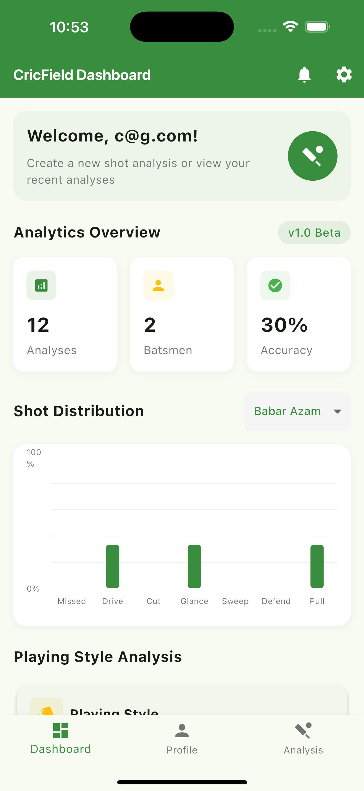
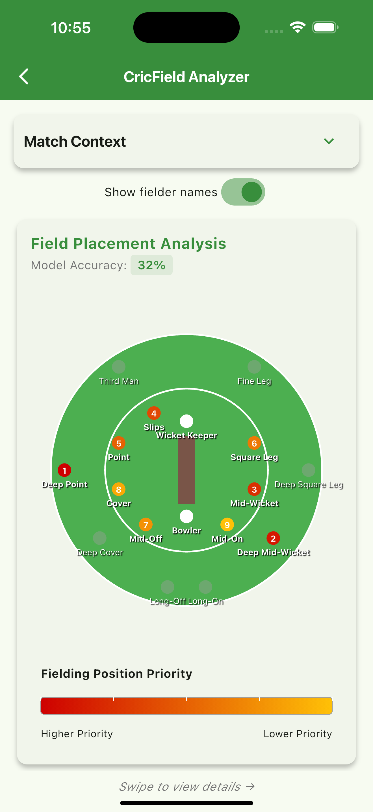

# CricField Analyzer

CricField Analyzer is a cross-platform Flutter application that leverages machine learning to provide advanced cricket field placement and shot analysis. It predicts optimal field placements and shot types based on match context, empowering players, coaches, and analysts with actionable insights.

---

## Features

- **Field Placement Prediction:** Suggests the top 9 fielding positions based on batsman, over range, pitch type, and bowler variation.
- **Shot Type Analysis:** Identifies the top 3 likely shot types for the given context.
- **Model Accuracy Display:** Shows the confidence level of predictions.
- **Interactive Wagon Wheel:** Visualizes field placements and shot types.
- **Customizable Visualization:** Toggle fielder names and expand/collapse match context.
- **Google & Firebase Auth:** Secure sign-in with Google and Firebase Authentication.
- **Multi-Platform:** Runs on Android, iOS, Web, Windows, macOS, and Linux.

---

## Screenshots




---

## Getting Started

### Prerequisites

- Flutter SDK (version 3.6.0 or higher)
- Dart SDK
- Android Studio or Xcode for running the app on Android/iOS
- Firebase project (for authentication and analytics)

### Installation

1. **Clone the repository:**
   ```sh
   git clone https://github.com/thecodemonster1/cric_field_project_1.git
   cd cric_field_project_1
   ```

2. **Install dependencies:**
   ```sh
   flutter pub get
   ```

3. **Configure Firebase:**
   - Add your `google-services.json` to `android/app/`
   - Add your `GoogleService-Info.plist` to `ios/Runner/`

4. **Run the app:**
   ```sh
   flutter run
   ```

---

## Project Structure

```
.
├── android/
├── assets/
│   └── images/
│       ├── CricField_Logo_BG.png
│       ├── CricField_Logo_BG2.png
│       └── Google_logo.png
│   └── models/
│       ├── enhanced_shot_placement_model.tflite
│       └── enhanced_shot_type_model.tflite
├── ios/
├── lib/
│   ├── Pages/
│   │   ├── LoginPage.dart
│   │   └── WagonWheelPage.dart
│   ├── Services/
│   │   └── Service.dart
│   └── theme/
│       └── app_theme.dart
├── pubspec.yaml
└── README.md
```

---

## Key Files

- [`lib/Pages/WagonWheelPage.dart`](lib/Pages/WagonWheelPage.dart): Wagon wheel visualization and prediction UI.
- [`lib/Services/Service.dart`](lib/Services/Service.dart): ML model loading and prediction logic.
- [`lib/Pages/LoginPage.dart`](lib/Pages/LoginPage.dart): Authentication UI and logic.
- [`pubspec.yaml`](pubspec.yaml): Project dependencies and asset declarations.

---

## Dependencies

- [flutter](https://pub.dev/packages/flutter)
- [tflite_flutter](https://pub.dev/packages/tflite_flutter)
- [tflite_flutter_helper](https://pub.dev/packages/tflite_flutter_helper)
- [percent_indicator](https://pub.dev/packages/percent_indicator)
- [fl_chart](https://pub.dev/packages/fl_chart)
- [shared_preferences](https://pub.dev/packages/shared_preferences)
- [url_launcher](https://pub.dev/packages/url_launcher)
- [google_sign_in](https://pub.dev/packages/google_sign_in)
- [firebase_core](https://pub.dev/packages/firebase_core)
- [firebase_auth](https://pub.dev/packages/firebase_auth)

---

## How It Works

1. **Input Match Context:** User selects batsman, over range, pitch type, and bowler variation.
2. **Model Prediction:** TensorFlow Lite models predict field placements and shot types.
3. **Visualization:** Results are shown on an interactive wagon wheel and as ranked lists.
4. **Customization:** Users can toggle fielder names and expand/collapse match context.

---

## Testing

To run unit tests:

```sh
flutter test
```

---

## Contributing

Contributions are welcome! Please:

1. Fork the repository.
2. Create a new branch: `git checkout -b feature/your-feature`
3. Commit your changes: `git commit -am 'Add new feature'`
4. Push to the branch: `git push origin feature/your-feature`
5. Open a pull request.

---

## License

This project is licensed under the MIT License. See the [LICENSE](LICENSE) file for details.

---

## Contact

- **Author:** Mohamed Amhar
- **Email:** amharmohamed@icloud.com
- **GitHub:** [thecodemonster1](https://github.com/thecodemonster1)

---

Thank you for using CricField Analyzer!
